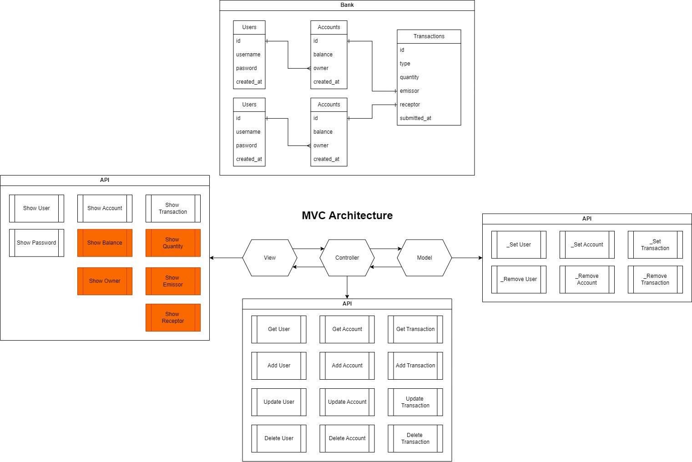

# Bank-System 

## Introduction 

The aim of this project is to simulate a real bank system. It was developed in Python and using SQLite for the database. 
The architecture was planned according to the following scheme:

## Features

* User Registration

* Account inheritance

* Docker compatibility

* Debug mode

For more information see the documentation.

## Instaling Method

## How to use?

1. Start programme 

2. Registrate as user

3. Make a deposit

Find all possible actions using the command `help`
